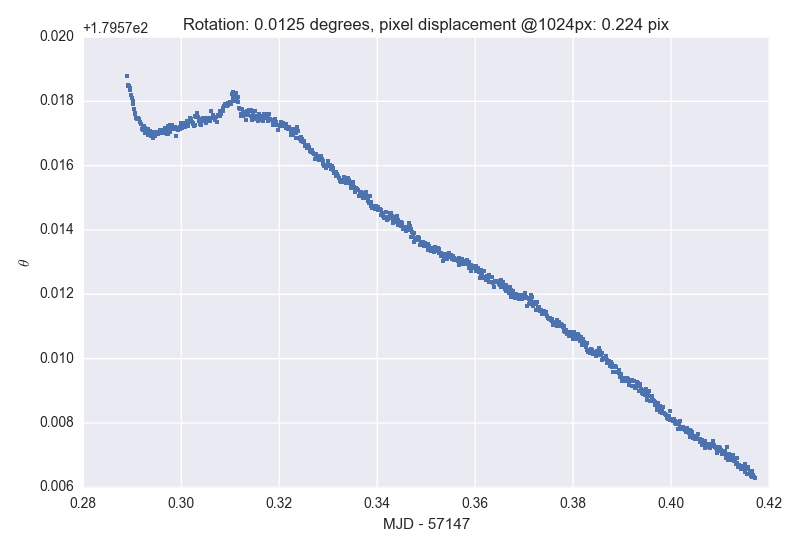

# Field rotation

*For computing the field rotation from a directory of solved fits files*

## Usage

The main script is `run_on_files.py`:

```
usage: run_on_files.py [-h] [--cache] [-o OUTPUT] [-p PLOT_TO] [-v] dirname

positional arguments:
  dirname

optional arguments:
  -h, --help            show this help message and exit
  --cache               Cache extracted information for files
  -o OUTPUT, --output OUTPUT
  -p PLOT_TO, --plot-to PLOT_TO
  -v, --verbose
```

This script takes a directory name on the command line and outputs two main products:

* a csv file containing the extracted information
* a png showing the field rotation as a function of time

Either or both of these can be disabled by using `/dev/null`.

The directory used must contain files called `proc*.fits` which is the (current) standard for reduced and astrometrically solved NGTS images.

An optional `--cache` argument uses the `joblib` module to cache the computation (which can take some time if there are a lot of files) for easier use. The cache is placed in `${PWD}/.tmp` which can be removed to update the cache.

## Example

The image below shows the computation for `20150504-ng2000-805`. The title contains the peak to peak rotation angle, and the pixel displacement at 1024 pixels.



## Requirements

All code is written in Python, and the following packages are required:

* `astropy`
* `matplotlib`
* `numpy`
* (optional) `joblib`
* (optional) `seaborn`